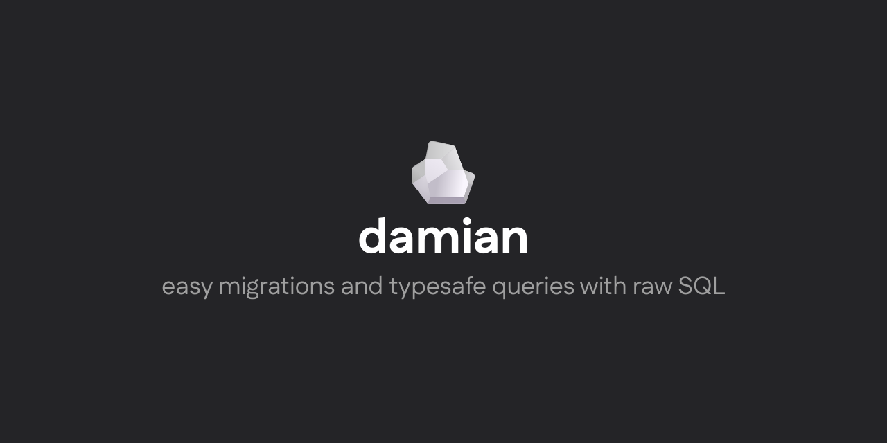

[](https://damiandb.vercel.app)

## Documentation

Visit https://damiandb.vercel.app to see the documentation.

## Registry

Visit [https://npmjs.com/package/damian](https://www.npmjs.com/package/damian) to see the registry.

## Installation

```bash
npm i -D damian && npm i @damiandb/pg
```

```bash
pnpm add -D damian && pnpm add @damiandb/pg
```

```bash
yarn add -D damian && yarn add @damiandb/pg
```

## Quickstart

### Config

Create a `damian.config.ts` file in the root of your project.

```ts
import { config } from "damian";

export default config({
	driver: "postgres",
	root: "./damian",
	migrationsTable: "public.migrations",
	url: process.env.DATABASE_URL!,
});
```

### Migrations

Run `damian new` to create a new migration.

```bash
npx damian new create_users_table
```

Edit the migration file to add your migration logic.

```sql
-- 20250909134557_create_users_table.sql

-- migrate:up

CREATE TABLE user (
    id SERIAL PRIMARY KEY,
    name TEXT NOT NULL,
    email TEXT NOT NULL UNIQUE
);

-- migrate:down

DROP TABLE user;
```

Afterwards, run `damian generate` in order to start using damian in your project.

```bash
npx damian generate
```

### Usage

Create a `db.ts` somewhere in your project (maybe inside `./damian`, it's up to you).

```ts
import { createDb, createSQL } from "@damiandb/pg";

export const db = await createDb({
	connectionString: env.DATABASE_URL!,
});

export const sql = createSQL()
```

Now you can import `db` and `sql` to run queries in your database, with full type safety and autocompletion.

```ts
import { UserTable } from 'tables'
import { db, sql } from 'db'

const searchParams = { email: "alice@example.com" }

const { rows } = await db.query(sql(UserTable)`
    SELECT * FROM ${UserTable}
    WHERE ${UserTable.email} = ${searchParams.email}
`)

// User: { id: number, name: string, email: string }
const user = rows[0]
```

## License

Licensed under the [MIT license](https://github.com/Fgc17/fatima/blob/fatima/LICENSE).
